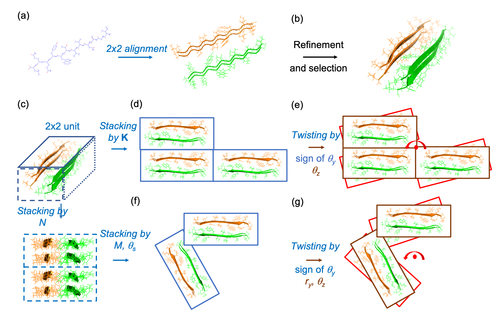
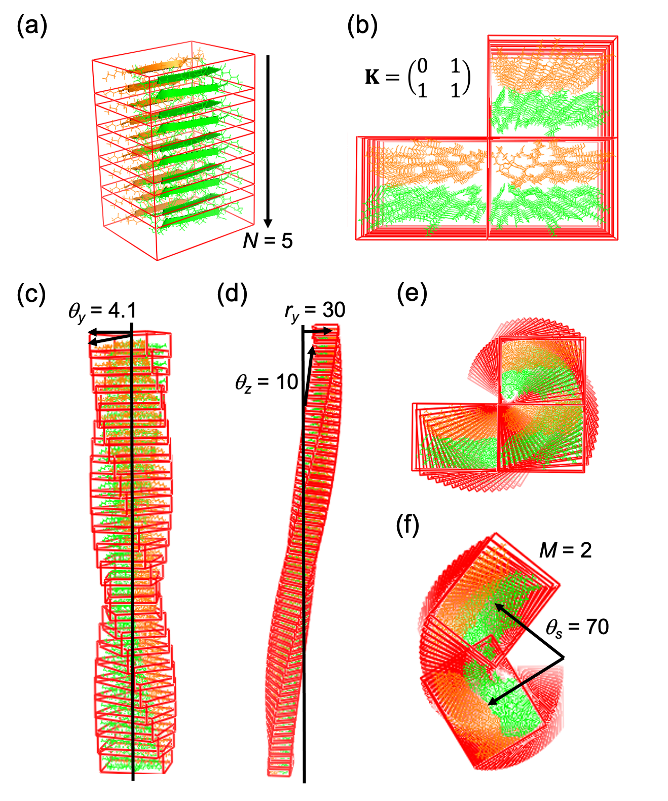
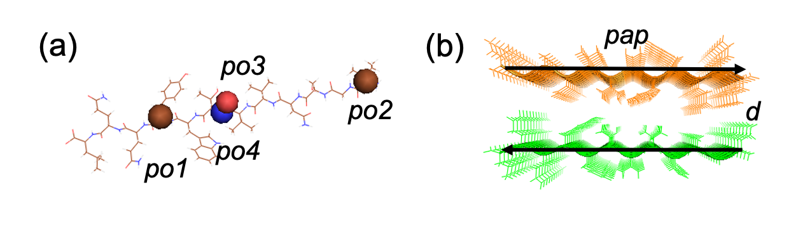
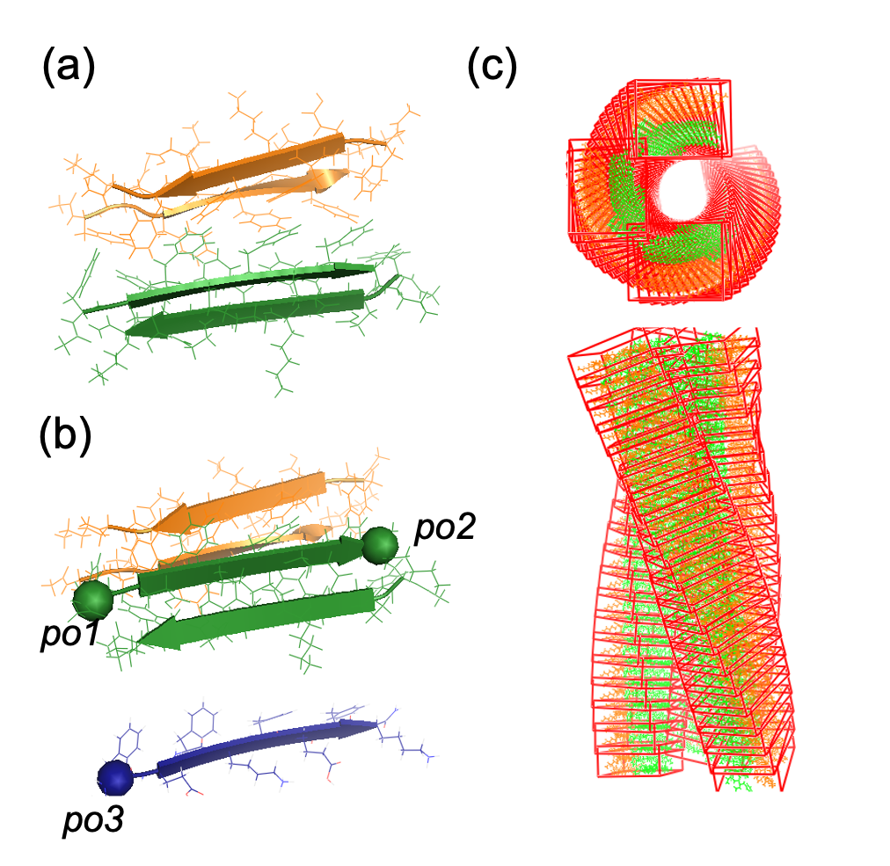

# FibrilGen
FibrilGen, a PyMOL plugin, enables the construction of various cross-beta structures with a set of controllable parameters. Such cross-beta structures could be modelled based on experimental data (e.g., cryo-EM or ssNMR data) or they could be purely hypothetical. A FibrilGen/MD workflow has been established for screening geometrically feasible and energetically favorable cross-beta structures (details in the published [paper](https://doi.org/10.1021/acs.jcim.5c02108)). Systematic exploration of various peptide assembly, protonation states, and solvent conditions can aid the design of peptide-based nanomaterials.



Figure 1. FibrilGen modeling of cross-beta structures. (a) A 2 x 2 alignment of a b-strand (b) A refinement of sidechain orientation (e.g., by energy minimization) (c) Vertical stacking of a 2 x 2 building block, where N is the number of units along the vertical axis (d) Horizontal stacking of the basic unit, where K is a binary matrix of k1 x k2 that assigns the present of units in k1 rows and k2 columns (e) Vertical twisting of the basic unit, where theta_z is the tilt angle from the vertical axis, theta_y is the twist angle around the vertical axis. The sign of theta_y is 1 for a left-handed chirality, and -1 for a right-handed chirality. (f) Horizontal stacking of the basic unit, where theta_s is an angular displacement and M is the number of units that are displaced as 0, theta_s, ..., (M-1)xtheta_s. (g) Vertical twisting of the basic unit, where r_y is the radius displaced from the vertical axis. Twist parameters theta_y, theta_z, r_y are automatically adjusted by FibrilGen to ensure the assembled structure is compact and non-intersecting. 

## Library functions
FibrilGen has six functions under the class "fibril". Each function takes a set of input parameters described below.
1. fibril.build_a_flat_sheet (N). The function “build_a_flat_sheet” takes only one parameter, N, to specify the repeat of the 2x2 unit along the beta-sheet axis.
2. fibril.build_a_stacked_sheet(K, N). The function “build_a_stacked_sheet” takes input parameters N and K to stack the 2x2 unit along the fibril long axis and on the fibril cross-section, respectively.
3. fibril.build_a_rod(theta_z, N, the sign of theta_y). The function “build_a_rod” takes an input parameter N to stack the 2x2 unit along the beta-sheet axis. An initial helical twist is assigned with a tilt angle theta_z and the direction (assigned to 1 or -1) of the twist angle theta_y.
4. fibril.build_a_stacked_rod(theta_z, K, N, the sign of theta_y). The function “build_a_stacked_rod” takes input parameters N and K for a linear stacking of the 2x2 unit along the fibril long axis and on the fibril cross-section. An initial helical twist is assigned with a tilt angle theta_z and the direction (assigned as 1 or -1) of the twist angle theta_y.
5. fibril.build_a_ribbon(theta_z, r_y, N, the sign of theta_y). The function “build_a_ribbon” takes an input parameter N to stack the 2x2 unit along the fibril long axis. An initial helical twist is assigned with a tilt angle theta_z, a radius r_y, and the direction (assigned as 1 or -1) of the twist angle theta_y.
6. fibril.build_a_stacked_ribbon(theta_z, r_y, theta_s, M, N, the sign of theta_y). The function “build_a_stacked_ribbon” takes input parameter N to stack the 2x2 unit along the fibril long axis. The rotational stacking on the fibril cross-section with an incremental rotation angle theta_s repeated for M times is assigned. An initial helical twist is assigned with a tilt angle theta_z, a radius r_y, and the direction (assigned as 1 or -1) of the twist angle theta_y. Here tube is a special case that theta_s∙M=360°.

## Software compatibility
Users can import FibrilGen library from PyMOL command line and use FibrilGen functions to generate their fibril structures. FibrilGen is compatible with PyMOL versions v2.3.5 (commercial), v1.7.4.5 (educational), and v2.3.0 (open-source). 

## Install open-source PyMOL via conda (recommended)
```bash
# Create a virtual environment
conda -n pymol
conda activate pymol
# Install PyMOL
conda install -c conda-forge pymol-open-source
# Initialize PyMOL
pymol
```

## Generate example structures
### 1. Import FibrilGen library
```bash
# Change the current directory to FibrilGen
cd [directory of FibrilGen]
# Import FibrilGen library 
run builder.py
```
### 2. Build FibrilGen structures
```bash
# Demonstrate building a beta-sheet structure
example('a_sheet')
# Demonstrate building a stacked beta-sheet structure
example('s_sheet')
# Demonstrate building a rod structure
example('a_rod')
# Demonstrate building a stacked rod structure
example('s_rod')
# Demonstrate building a ribbon structure
example('a_ribbon')
#  Demonstrate building a stacked ribbon structure
example('s_ribbon')
```
### 3. Output structures



Figure 2. Output structures after calling (a) example('a_sheet'), (b) example('s_sheet'), (c) example('a_rod'), (d) example('a_ribbon'), (e) example('s_rod'), or (f) example('s_ribbon').


## Generate new building blocks
### 1. Modify scripts/bilayer_init.py to initialize a bilayer beta-sheet structure
```bash
# Import pep2unit library
pymol.cmd.run('pep2unit.py')
# Load a beta-strand
pymol.cmd.load('structures/input/AL1.pdb')
# Select a reference coordinate system from the beta-strand
pymol.cmd.select('po1','resi 10 and name ca')
pymol.cmd.select('po2','resi 2 and name ca')
pymol.cmd.select('po3','resi 7 and name O')
pymol.cmd.select('po4','resi 8 and name N')
# Assign a reference coordinate system
unit = create_pep_unit('AL1','po1','po2','po3','po4')
# Create a sheet object
sheet = create_sheet(unit,[0,11],[0,11])
# Build a bilayer structure
sheet.build_a_plain_sheet(['pap','d'],5) # Parameters of ([backbone alignment (e.g., aaa,apa,aap,app,paa,ppa,pap,ppp), beta-sheets arranged face-to-face (assigning 'd') or face-to-back (assigning 's')] and the number of units in each sheet
```
### 2. Execute bilayer_init.py in the PyMOL command line
```bash
run scripts/bilayer_init.py
```
### 3. Output structures



Figure 3. Building a bilayer structure. (a) A linear segment is selected from the peptide to construct a reference coordinate system (b) Peptide assembly with parallel/ antiparallel alignments. The input peptide, reference coordinate system, and peptide alignment can be changed. 

##  Generate new fibril structures
### 1. Modify scripts/fibril_init.py to initialize a cross-beta nanostructure
```bash
# Import FibrilGen library
pymol.cmd.run('builder.py')
# Load a bilayer structure
pymol.cmd.load('structures/input/capF8_bilayer.pdb')
# Select four peptides p1,p2,p3,p4 to construct a 2x2 assembly unit
pymol.cmd.select('p1','resi 21-30')
pymol.cmd.select('p2','resi 31-40')
pymol.cmd.select('p3','resi 111-120')
pymol.cmd.select('p4','resi 121-130')
# Select three atoms po1,po2,po3 to construct a reference coordinate system
pymol.cmd.select('po1','resi 22 and name ca')
pymol.cmd.select('po2','resi 29 and name ca')
pymol.cmd.select('po3','resi 62 and name ca')
# Create a periodic unit
unit = create_sheet_unit('p1','p2','p3','p4','po1','po2','po3')
# Create a fibril object
fibril = create_fibril(unit)
# Build a cross-beta structure (e.g., a ribbon)
fibril.build_a_stacked_ribbon(10,30,90,3,20,1)
```
### 2. Execute fibril_init.py in the PyMOL command line
```bash
run scripts/fibril_init.py
```
### 3. Output structures



Figure 4. Building a cross-b structure. (a) A 2 x 2 unit selected from the bilayer structure (b) C_alpha atoms from the bilayer to construct a reference coordinate (c) A ribbon model of stacking and twisting the 2 x 2 unit. The input bilayer, 2 x 2 unit, reference coordinate system, fibril model, and the value of geometrical parameters can be changed. 

## Hypothesizing fibril structures
### 1. Cryo-EM/ ssNMR data are available
The 3D reconstruction of cryo-EM electron density could provide the beta-sheet stacking pattern on the fibril cross-section and a rough estimation of helical twist. In this way, we can assign a linear stacking K or a rotational stacking (M, theta_s); and a helical twist of the fibril chirality (the sign of theta_y), tilt angle theta_z, and radius r_y. Data ssNMR that confirms peptide alignments inside the electron density can assign a 2 x 2 unit.
### 2. Experimental data are not available
The modelling scheme in Figure 2 is the conformational space of FibrilGen, where the choice of the 2 x 2 unit is discrete, the parameter space (K, M, theta_s) is discrete, and the parameter space (r_y, theta_y, theta_z) is continuous. In FibrilGen, the 2 x 2 unit and the stacking parameters (K, M, theta_s) determine a combinatorial peptide assembly and constrain the feasible helical twists. FibrilGen features feasible geometrical relations by automatically refining each initial helical twist (r_y, the sign of theta_y, theta_z) to a compact and non-overlapping fibril assembly.
### 3. FibrilGen/ MD modeling pipeline
FibrilGen provides geometrically feasible peptide assemblies with pre-assembled backbone hydrogen bonding and sidechain packing. Whether such an assembly is energetically favorable can be assessed by energy minimization, heating equilibration, and MD simulation. A modelling pipeline combining FibrilGen with MD simulation to accept or reject hypothetical structures can provide a systematic investigation of fibril assembly in various protonation states and solvent conditions.

## License
The code is free for non-commercial use.

## Contact information
Please email Chao-Yu Yang at chao-yu.yang@postgrad.manchester.ac.uk or cherryyang0215@gmail.com.

## Citation
Chao-Yu Yang, Aline F. Miller, Alberto Saiani, Richard A. Bryce. FibrilGen: a Python package for atomistic modelling of peptide b-sheet nanostructures, JCIM, (2025). DOI:[10.1021/acs.jcim.5c02108](https://doi.org/10.1021/acs.jcim.5c02108)

